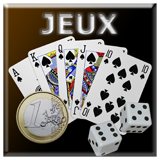

# Games
Games est un plugin de jeux vocaux pour A.V.A.T.A.R. permettant de jouer entièrement à la voix

- This plugin is an add-on for the [A.V.A.T.A.R](https://avatar-home-automation.github.io/docs) framework.

- 🎮 Jeux disponibles :

🃏 Tirage aléatoire d'une carte
🎲 Lancer d'un dé
🎲🎲 Lancer de deux dés avec calcul du total
🪙 Jeu de pile ou face avec détection de victoire ou de défaite
♠️ Blackjack interactif avec gestion des cartes, des points, de l'As, du joueur et du croupier

## 🎯 Usage
Commandes :
- choisie une carte
- lance un dé ou lance 2 dés
- lance une piéce ou pile ou face
- blackjack

## Multi-room

The Games plugin is fully multi-room.

## Multi-language

The Games plugin relies solely on the system's available languages.

   <table style="border: none;">
  <tr>
    <td style="border: none;"></td>
    <td style="border: none;">
      <h1 style="margin: 0;color: brown;">Games</h1>
      <h3 style="margin: 0;">Play Games</h3>
    </td>
  </tr>
</table>
